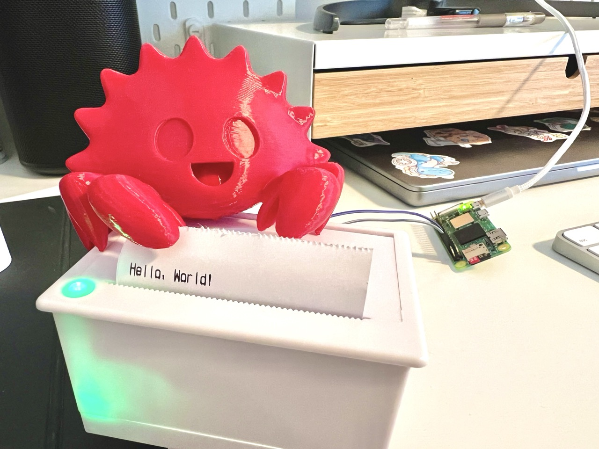

# thermo

Control a thermal printer with a Raspberry Pi using Rust and WebSockets.

This repo has two main components:

- A relay server that receives print jobs
- A client running on the Pi that reads print jobs from the relay and operates the printer

## Bill of Materials

1. Soldering iron and solder
2. Raspberry Pi Zero 2 W with power supply and microSD card
3. QR204 thermal printer, baud rate 9600, TTL, page width: 58 mm
4. Paper rolls for the printer
5. 5–9 V, 2 A universal power adapter, 5.5 × 2.1 / 2.5 mm
6. Panel-mount DC-022B female DC power jack (5.5 × 2.1 mm / 5.5 × 2.5 mm) with JST 2-pin male plug (2-pin pitch) on a 15 cm wire lead

## Assembly

### Wiring

You cannot power the printer from the Pi's GPIO pins.  
Instead, use the universal power adapter (5), plug it into the female DC power jack (6), and connect its VCC and GND to the printer's VIN and GND.

To control the printer, wire the Pi and printer like this:

| Printer | Pi            |
| ------- | ------------- |
| GND     | GND           |
| RX      | TXD (GPIO 14) |

The printer comes with a 5-pin JST connector (male-to-male), but you only need GND and RX.

## Software

The project has two parts:

- `server/`: a print relay server with basic auth
- `os/`: the printer client that connects to the relay over WebSocket and prints incoming jobs

### Requirements

You need [Rust](https://www.rust-lang.org/tools/install), [Docker](https://docs.docker.com/get-docker/), and, for convenience, [just](https://just.systems/) installed on your development machine.

### Server

Rename `.env.example` to `.env` in `server/`. Alter the values if you want, but that's optional.

Run the relay server from `server/` with `cargo run`, or build a binary with `cargo build --release`.

The relay exposes:

- `POST /print` to submit a print job as JSON: `{ "text": "hello" }`
- `GET /print/ws` as the authenticated WebSocket endpoint the printer connects to
- `GET /form` to get a simple HTML form for submitting print jobs from the browser

### OS

Use SSH to connect to your Pi, run `sudo raspi-config`, navigate to `Interfacing Options`, and **disable** the `Serial Port` login shell while **enabling** the serial hardware.  
Reboot the Pi with `sudo reboot` to apply the changes.

Rename `.env.example` to `.env` in `os/` and set the environment variables:

- `PI_USER`: user on your Pi
- `PI_IP`: IP address of your Pi
- `SERVER_URL`: URL of your relay server, e.g. `http://localhost:3000`
- `BASIC_AUTH_USER` and `BASIC_AUTH_PASSWORD`: credentials for the relay server

Make sure the basic auth credentials used here match the ones set via environment variables in `server/`.

Then run `just run-remote` from `os/` to cross-compile the client inside Docker, send it to the Pi via `scp`, and run it there.

Finally, send a print job to the relay server via the web form at `<server_url>/form`, e.g. `http://localhost:3000/form`.
The username and password are the basic auth credentials you set in the server's environment variables.

Happy printing!
